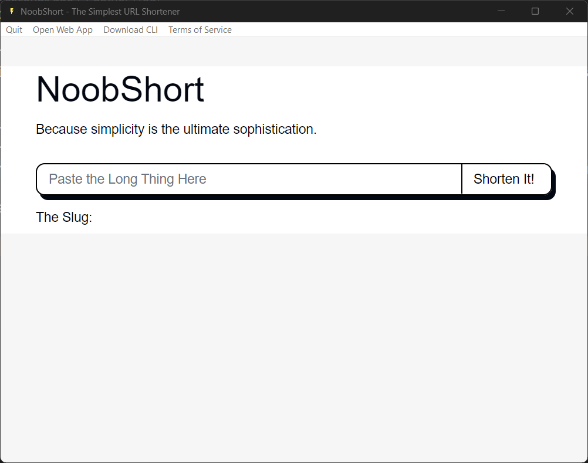

# NoobShort GUI

Learning and making a desktop app was always on my bucket list. So, I decided to make a GUI for [NoobShort](https://www.noobscience.rocks/go), a URL shortener I made a while ago.

Tauri made my life so much easier. I already had a component that could shorten URLs, so I just had to make a GUI for it.
I installed tailwindCSS, shadcn/ui and I was good to go.

This is how it looks like on my windows machine:

## How to run

1. Clone the repo
2. Install dependencies: `npm install`
3. Run the app: `npm tauri dev`

## How to build

To build, just run `npm tauri build`. The executable will build for your current OS.

## Todo List

- [ ] Add custom URL support
- [ ] Add a settings page
- [ ] Add a dark mode
- [ ] Add a history page
- [ ] Improve the UI

## License

[MIT](LICENSE)

## More in the NoobShort EcoSystem

- [NoobShort](https://www.noobscience.rocks/go) - The URL shortener
- [NoobShort CLI](https://www.github.com/newtoallofthis123/short_cli) - The CLI for NoobShort
- [NoobShort GUI](https://www.github.com/newtoallofthis123/short_gui) - The GUI for NoobShort

## Credits

- [Tauri](https://tauri.studio) - The framework used to build the app
- [shadcn/ui](ui.shadcn.com) - The UI framework used to build the app
- [tailwindCSS](https://tailwindcss.com) - The CSS framework used to build the app
- [vite](https://vitejs.dev) - The bundler used to build the app
